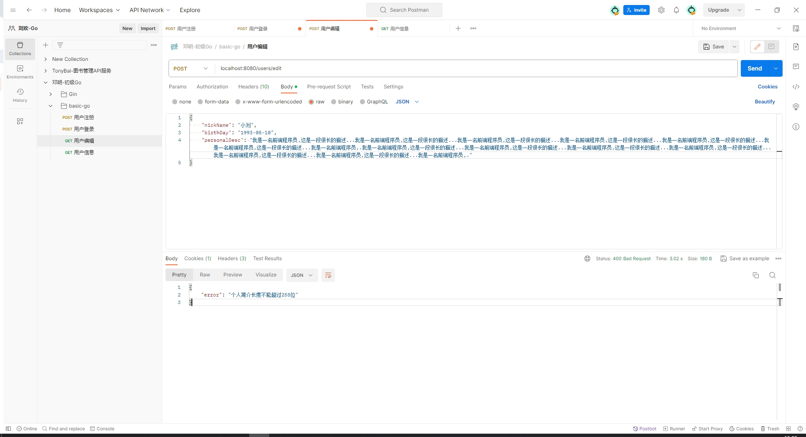
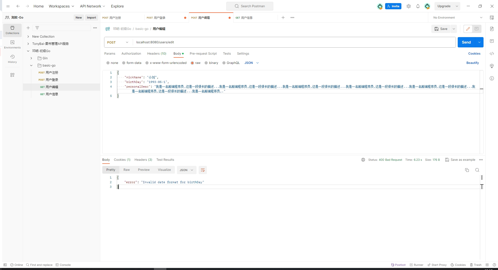
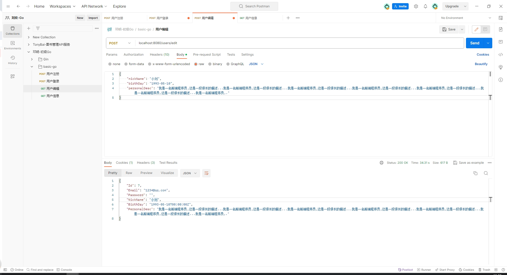
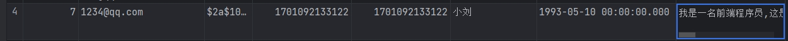

# 作业02

```
实现编辑功能

你需要完善 /users/edit 对应的接口。要求：
• 允许用户补充基本个人信息，包括：
• 昵称：字符串，你需要考虑允许的长度。
• 生日：前端输入为 1992-01-01 这种字符串。
• 个人简介：一段文本，你需要考虑允许的长度。
• 尝试校验这些输入，并且返回准确的信息。
• 修改 /users/profile 接口，确保这些信息也能输出到前端。

不要求你开发前端页面。提交作业的时候，顺便提交 postman 响应截图。加一个 README 文件，里面贴个图。

就是补充 live 分支上的 Edit 和 Profile 接口

PS：暂时不要求上传头像，后面我们讲到 OSS 之后直接用 OSS。
```


# 作业提交commit

edit接口：https://github.com/aniviaH/basic-go/commit/0a4f1412e0b12f32b1b4813060b22e1186698735

profile接口：https://github.com/aniviaH/basic-go/commit/2447127050f1cc4eb0d7d502ce03b04dd6828224


# postman截图

## 昵称/个人简介长度校验



## 生日时间字符格式校验



## 提交成功



