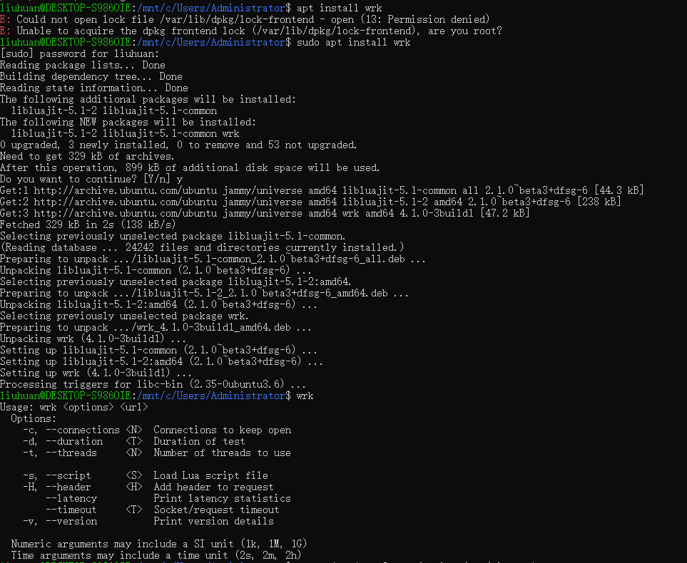
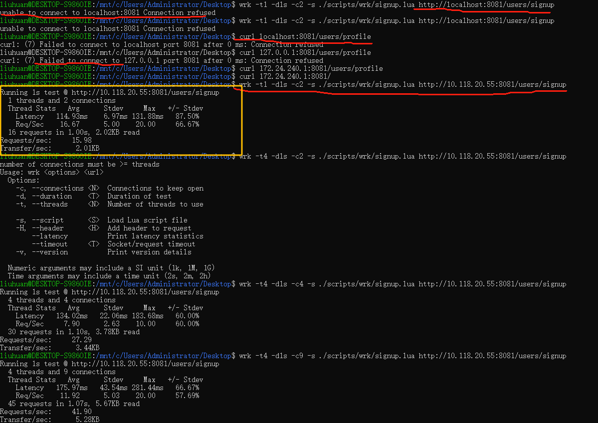

1. 使用wsl进入

2. 安装wrk，需要使用管理员权限

1. ls 一下看一下自己所处目录(或者pwd)
  /mnt/c/Users/Administrator/

2. cd Desktop

3. 将lua脚本的文件夹复制一份到宿主机的桌面去

wsl里面能访问宿主机的桌面的文件

5. 执行如下命令进行运行，注意，这里需要使用宿主机的ip来访问，使用localhost或者127.0.0.1访问不到

wrk -t1 -d1s -c2 -s ./scripts/wrk/signup.lua http://10.118.20.55:8081/users/signup
Running 1s test @ http://10.118.20.55:8081/users/signup
  1 threads and 2 connections
  Thread Stats   Avg      Stdev     Max   +/- Stdev
    Latency   114.93ms    6.97ms 131.88ms   87.50%
    Req/Sec    16.67      5.00    20.00     66.67%
  16 requests in 1.00s, 2.02KB read
Requests/sec:     15.98
Transfer/sec:      2.01KB

